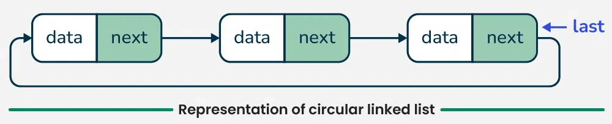
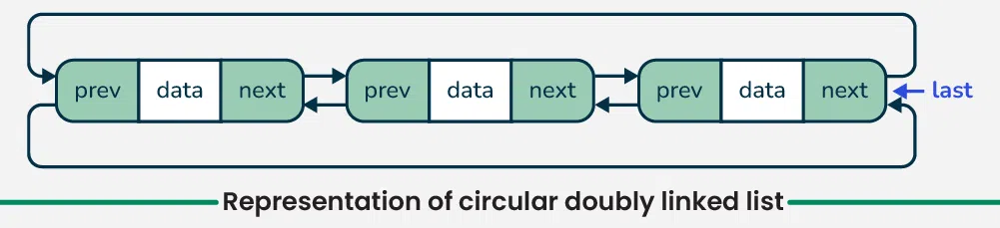

## What is a linked list?
Linked List is a linear data structure where each element(node) contains:
- Data
- A reference(or pointer) to the next node(optionally, the previous node)

##  What are the different types of linked lists?
There are 3 types of linked list:
1. #### Singly Linked List
- Each node points to the next node
- Last node points to the `null`
- Traversal is one directional (forward only)
- [Data | Next] ==> [Data | Next] ==> [Data | null]
- useful when reverse traversal isn't needed

2. #### Doubly Linked List
- Each node points to the next node
- Each node points to the previous node
- Traversal is bi-directional (both forward and backward)
- null <== [Prev | Data | Next] <==> [Prev | Data | Next] ==> null
- useful when needed fast forward and backward navigation

3. #### Circular Linked List
- Last node points to the first node, forming a circle.
- It has 2 types:
  1. Singly Circular Linked List
     - Last node's `next` points to head. 

     

  2. Doubly Circular Linked List
     - Last node's `next` points to head.
     - Head's `prev` points to last.  

       

 

## What are the advantages of a Linked List?
- Dynamic Memory Allocation
  - Grows and shrinks at runtime, using memory efficiently
  - no need to declare size in advance
- Efficient Insertion & Deletion
  - only pointers are updated, no need to shift elements in the array
- Ease of Implementation for Complex Data Structures
  - Stack, Queue and Graphs are easy to implement using linked list

## What are the disadvantages of a Linked List?
- No random access
  - unlike arrays one can't directly access to element via index, it required traversal from head which can be slow.
- More memory overhead
  - each node required extra memory to store pointers.
- Difficult to debug
  - due to the pointers manipulation and dynamic memory allocation, makes it hard to track errors.

## What are the applications of a Doubly Linked List?
- Browser History
  - use to track history of visited pages, enable to navigate visited pages forward and backward
- Undo Operations in Applications
  - applications like word processors, allows undo or redo operations

## What are the applications of a Circular Linked List?
- Round-robin scheduling
  - an algorithm used for multitasking operating systems where each process is assigned a fixed time slice to execute a cyclic order.
- A Playlist
  - wrap around to the beginning after reaching the end.